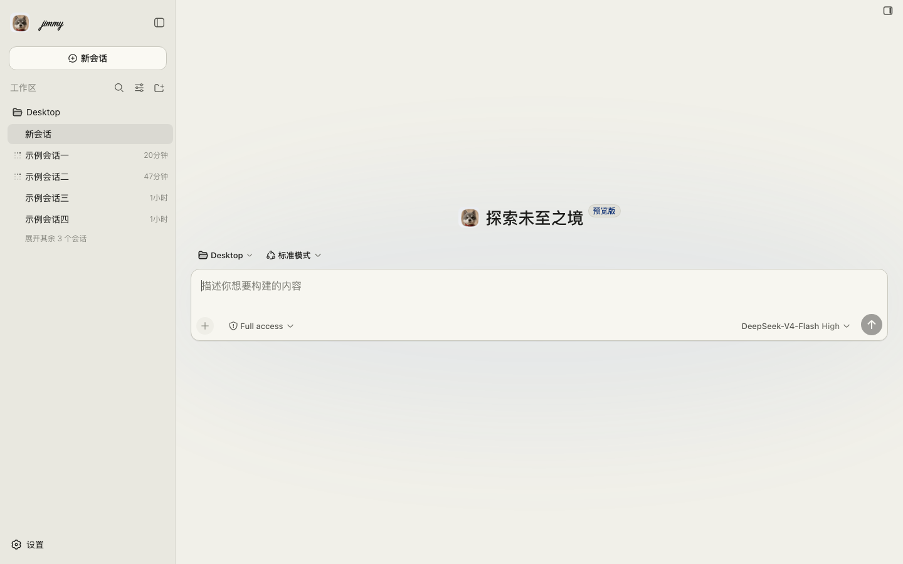

# dsh-inkscreen-theme

An ink-and-paper, Apple-glass theme for the [DeepSeek Harness](https://github.com/deepseek-ai) web client (`dsh web`).

It restyles the chat shell with soft frosted-glass panels, warm cream/ink colors,
and a monospace code voice, and it replaces the sidebar brand mark with a
handwritten **"jimmy"** wordmark next to a small dog avatar.



## Install

```sh
dsh plugin add dsh-inkscreen-theme
```

or add it to your profile's `package.json` as a `file:`/npm dependency and list
it in `dsh.profile.bundles`, then restart `dsh web` (this plugin changes package
identity/CSS injected at boot, so a hot-reload is not enough).

## What it does

- Injects a `<style>` block with e-ink/Apple-glass CSS variables and rules for
  the sidebar, dialogs, and scrollbars.
- Watches the sidebar brand element and replaces its content with a
  handwritten wordmark (`Caveat` webfont, falling back to a system cursive
  font) plus a small rounded-square dog avatar image.

## Personalization note

The wordmark text ("jimmy") and the avatar image are hard-coded — this is a
personal theme, not a generic template. If you want your own name/avatar,
fork the repo and edit the `name`/`DOG_LOGO` constants near the top of
`lib/client.js`.

## License

MIT — see [LICENSE](./LICENSE).
