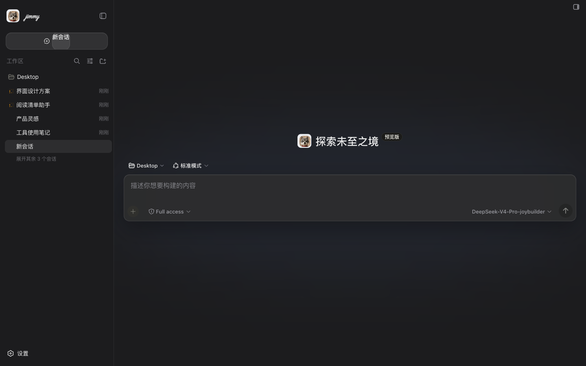

# dsh-inkscreen-theme

An ink-and-paper, Apple-glass theme for the [DeepSeek Harness](https://github.com/deepseek-ai) web client (`dsh web`).

It restyles the chat shell with soft frosted-glass panels, warm cream/ink colors,
an editorial Kai/handwritten voice for conversation text, and crisp monospace
code. It also replaces the sidebar brand mark with a handwritten **"jimmy"**
wordmark next to a small dog avatar. A native dark mode keeps the same ink-and-
paper character with Apple's neutral-gray surface hierarchy, translucent panels,
soft white text, and a restrained amber accent.




## Install

```sh
dsh plugin add dsh-inkscreen-theme
```

or add it to your profile's `package.json` as a `file:`/npm dependency and list
it in `dsh.profile.bundles`, then restart `dsh web` (this plugin changes package
identity/CSS injected at boot, so a hot-reload is not enough).

## What it does

- Injects a `<style>` block with e-ink/Apple-glass CSS variables and rules for
  the sidebar, dialogs, composer, code blocks, and scrollbars.
- Automatically follows DSH's light/dark appearance setting. Dark mode uses
  Apple's neutral-gray elevation hierarchy, translucent materials, soft-white
  type, and amber only for meaningful accents instead of bluntly inverting colors.
- Gives Chinese conversation text a readable Kai-style editorial voice,
  expressive handwritten headings, and preserves monospace for code.
- Adds a compact recent-conversation tab rail above the chat, with live status
  dots for running, waiting-for-input, completed, and idle sessions; clicking a
  tab switches directly to that conversation.
- Places the built-in **Conversation / Trace** view switch on the same header
  row, styled as a compact segmented control for quick context switching.
- Watches the sidebar brand element and replaces its content with a
  handwritten wordmark (`Caveat` webfont, falling back to a system cursive
  font) plus a small rounded-square dog avatar image.

## Personalization note

The wordmark text ("jimmy") and the avatar image are hard-coded — this is a
personal theme, not a generic template. If you want your own name/avatar,
fork the repo and edit the `name`/`DOG_LOGO` constants near the top of
`lib/client.js`.

## License

MIT — see [LICENSE](./LICENSE).
